

  

<h2> 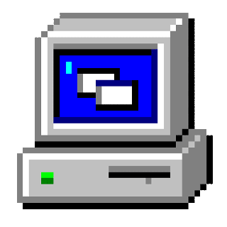</h2>

  
  
  

<picture>
  <source media="(prefers-color-scheme: dark)" srcset="assets/focus-typing-dark.svg" />
  
</picture>

> With a background in **remote sensing**, I build practical software and **AI Agent applications**.

<picture>
  <source media="(max-width: 620px) and (prefers-color-scheme: dark)" srcset="assets/education-dark-compact.svg" />
  <source media="(max-width: 620px)" srcset="assets/education-light-compact.svg" />
  <source media="(prefers-color-scheme: dark)" srcset="assets/education-dark.svg" />
  
</picture>

 

## My toolbox

  &nbsp;&nbsp;
  &nbsp;&nbsp;
  &nbsp;&nbsp;
  &nbsp;&nbsp;
  &nbsp;&nbsp;
  

## Things I'm building

<a href="https://github.com/MoChiUaena/agent-triage"><picture><source media="(max-width: 620px) and (prefers-color-scheme: dark)" srcset="assets/project-agent-triage-dark-compact.svg" /><source media="(max-width: 620px)" srcset="assets/project-agent-triage-light-compact.svg" /><source media="(prefers-color-scheme: dark)" srcset="assets/project-agent-triage-dark.svg" />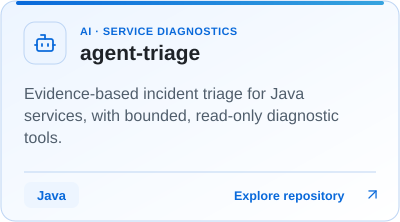</picture></a>
<a href="https://github.com/MoChiUaena/resume-workbench"><picture><source media="(max-width: 620px) and (prefers-color-scheme: dark)" srcset="assets/project-resume-workbench-dark-compact.svg" /><source media="(max-width: 620px)" srcset="assets/project-resume-workbench-light-compact.svg" /><source media="(prefers-color-scheme: dark)" srcset="assets/project-resume-workbench-dark.svg" />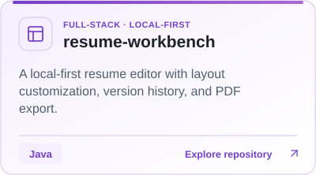</picture></a>

<a href="https://github.com/MoChiUaena/RSHOT"><picture><source media="(max-width: 620px) and (prefers-color-scheme: dark)" srcset="assets/project-rshot-dark-compact.svg" /><source media="(max-width: 620px)" srcset="assets/project-rshot-light-compact.svg" /><source media="(prefers-color-scheme: dark)" srcset="assets/project-rshot-dark.svg" />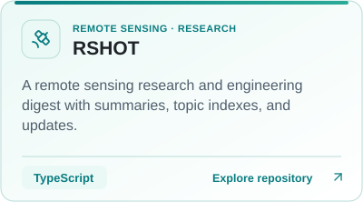</picture></a>
<a href="https://github.com/MoChiUaena/tech-resume-kit"><picture><source media="(max-width: 620px) and (prefers-color-scheme: dark)" srcset="assets/project-tech-resume-kit-dark-compact.svg" /><source media="(max-width: 620px)" srcset="assets/project-tech-resume-kit-light-compact.svg" /><source media="(prefers-color-scheme: dark)" srcset="assets/project-tech-resume-kit-dark.svg" />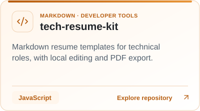</picture></a>

## Projects I contribute to

Fixes and improvements in the Java ecosystem.

<a href="https://github.com/OpenAPITools/openapi-diff"><picture><source media="(max-width: 620px) and (prefers-color-scheme: dark)" srcset="assets/project-openapi-diff-dark-compact.svg" /><source media="(max-width: 620px)" srcset="assets/project-openapi-diff-light-compact.svg" /><source media="(prefers-color-scheme: dark)" srcset="assets/project-openapi-diff-dark.svg" />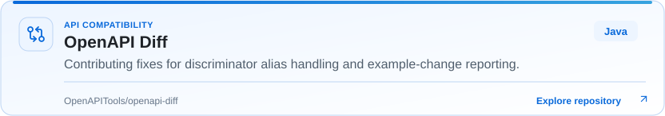</picture></a>

  My PRs:
  <a href="https://github.com/OpenAPITools/openapi-diff/pull/929"><picture><source media="(prefers-color-scheme: dark)" srcset="assets/pr-openapi-diff-929-dark.svg" /></picture></a>
  <a href="https://github.com/OpenAPITools/openapi-diff/pull/930"><picture><source media="(prefers-color-scheme: dark)" srcset="assets/pr-openapi-diff-930-dark.svg" /></picture></a>

<a href="https://github.com/resilience4j/resilience4j"><picture><source media="(max-width: 620px) and (prefers-color-scheme: dark)" srcset="assets/project-resilience4j-dark-compact.svg" /><source media="(max-width: 620px)" srcset="assets/project-resilience4j-light-compact.svg" /><source media="(prefers-color-scheme: dark)" srcset="assets/project-resilience4j-dark.svg" />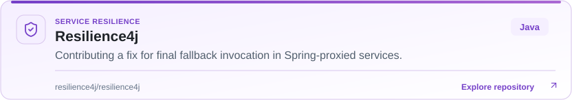</picture></a>

  My PRs:
  <a href="https://github.com/resilience4j/resilience4j/pull/2536"><picture><source media="(prefers-color-scheme: dark)" srcset="assets/pr-resilience4j-2536-dark.svg" />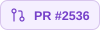</picture></a>

<a href="https://github.com/Snailclimb/interview-guide"><picture><source media="(max-width: 620px) and (prefers-color-scheme: dark)" srcset="assets/project-interview-guide-dark-compact.svg" /><source media="(max-width: 620px)" srcset="assets/project-interview-guide-light-compact.svg" /><source media="(prefers-color-scheme: dark)" srcset="assets/project-interview-guide-dark.svg" />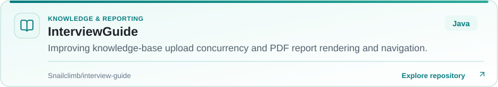</picture></a>

  My PRs:
  <a href="https://github.com/Snailclimb/interview-guide/pull/58"><picture><source media="(prefers-color-scheme: dark)" srcset="assets/pr-interview-guide-58-dark.svg" /></picture></a>
  <a href="https://github.com/Snailclimb/interview-guide/pull/59"><picture><source media="(prefers-color-scheme: dark)" srcset="assets/pr-interview-guide-59-dark.svg" /></picture></a>
  <a href="https://github.com/Snailclimb/interview-guide/pull/60"><picture><source media="(prefers-color-scheme: dark)" srcset="assets/pr-interview-guide-60-dark.svg" /></picture></a>

## Every commit counts

A little fun along the way.

### Bomberman

<picture>
  <source media="(prefers-color-scheme: dark)" srcset="assets/bomberman-dark.svg" />
  
</picture>

### A little more depth

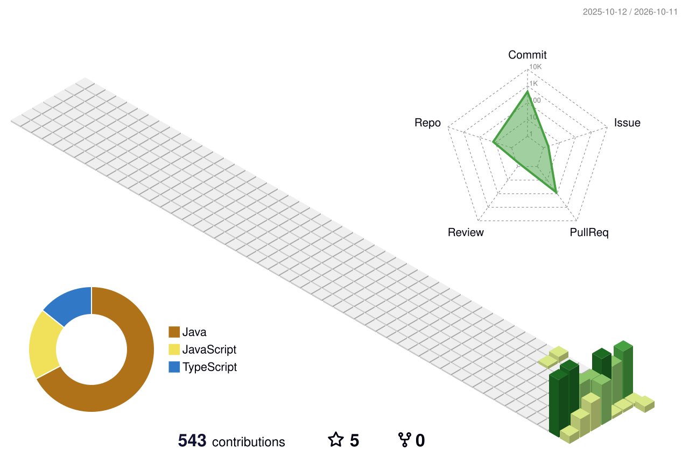

---

  <samp>Keep building. Keep learning.</samp>  
  <a href="https://github.com/MoChiUaena">Find me on GitHub</a>

Visual credits

- Banner: [sourabmaity](https://github.com/sourabmaity/sourabmaity)
- Illustration: [onimur](https://github.com/onimur/.github)
- Hello Coders: [SP-XD](https://github.com/SP-XD/SP-XD)
- PC GIF: [TheDudeThatCode](https://github.com/TheDudeThatCode/TheDudeThatCode)
- Contribution animation: [abozanona](https://github.com/abozanona/pacman-contribution-graph)
- 3D contribution visualization: [yoshi389111](https://github.com/yoshi389111/github-profile-3d-contrib)
- Technology icons: [Devicon](https://github.com/devicons/devicon)
- Interface icons: [Lucide](https://github.com/lucide-icons/lucide)
- Typing animation: [README Typing SVG](https://github.com/DenverCoder1/readme-typing-svg)

